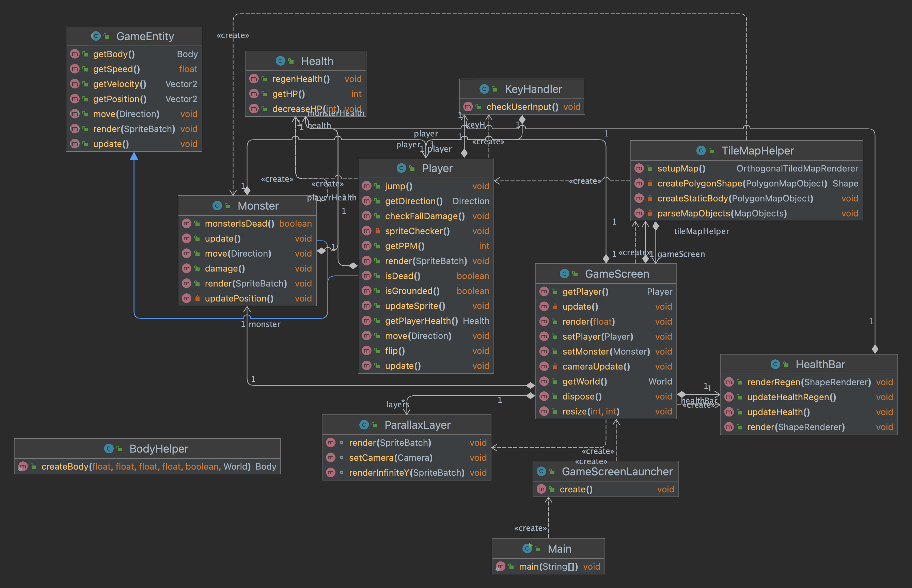

Del B

Rollene i teamet fungerer fint. Vi jobber litt hver for oss med forskjellige oppgaver også pleier vi å merge litt når vi møtes. Tarjei tar ansvar for dette ettersom han har mest erfaring med merging. Vi har ikke valgt noe teamlead ettersom vi klarer oss fint uten. Kundekontakten funker fint, selv om han ikke har hatt noe særlig kontakt med kunder.. 

Vi hadde ikke skrevet om dette som en rolle sist. Men Brage har fått ansvar for å lage sprites/texture. Så han har en slags designer-rolle. 

Er det noen erfaringer enten team-messig eller mtp prosjektmetodikk som er verdt å nevne? Synes teamet at de valgene dere har tatt er gode? Hvis ikke, hva kan dere gjøre annerledes for å forbedre måten teamet fungerer på?

Vi synes at valget å bruke Discord fungerer fint. Trello-board for ideer funker også bra. Foreløpig har vi vært fornøyd med valgene vi har tatt. Vi har pleid å dele ut oppgaver til hver enkelt og det har egentlig fungert fint.  

Gruppedynamikken er fin. Det har ikke oppstått noen konflikter enda. Kommunikasjonen funker som nevnt tidligere fint og det skjer over Discord. 

Gjør et kort retrospektiv hvor dere vurderer hva dere har klart til nå, og hva som kan forbedres. Dette skal handle om prosjektstruktur, ikke kode. Dere kan selvsagt diskutere kode, men dette handler ikke om feilretting, men om hvordan man jobber og kommuniserer.

Det vi har klart til nå er å bruke git som et verktøy. Vi har lært mye om merging og branches. Vi er fornøyde med hvordan prosjektet vårt er blitt bygd opp, nemlig steg for steg. Da har det vært lett å dele ut oppgaver og henge med. Ting vi kan bli bedre på er å si hvor langt vi er kommet på forskjellige oppgaver. I tillegg kan vi bli flinkere til å skrive tester underveis. Selv om vi kanskje ikke har trengt det foreløpig, kan vi bli bedre til å spørre hverandre om hjelp til koding utenom de tidene vi møtes. 

Forbedringspunkter som skal følges opp:

-   Skrive tester underveis

-   Si hvor langt vi er kommet på oppgaver

-   Spørre hverandre om hjelp til koding

REFERAT møte Torsdag. 23/02/2023

Tilstede:

Vetle, Ole, Brage, Kavya og Tarjei

Dette møte handlet om at vi diskuterte rundt libGDX sitt rammeverket. Vetle hadde laget en liten demo ved hjelp av online tutorials, og brukte dette til å forklare oss hvordan grunnlaget for spillet fungerte. Videre lærte vi om programmet Tiled, som vi tenker å bruke til å lage tile-based map. Vi oppdaterte Trello boarde med flere spesifikke arbeidsoppgaver, med mindre deloppgaver under som måtte gjøres. Her la vi blant annet til health bar som måtte gjøres.

Det oppsto en merge conflict under gruppetimen, her samlet vi oss sammen for å lære hvordan vi skulle løse slike problemer til fremtiden. 

Vi delte ut oppgaver:

Tarjei skal prøve å lage sverd/våpen

Kavya skal prøve å lage health/liv (og prøve å omorganisere filene til MVC)

Brage skal lage pixelart sprites / Color palette

Ole-Kristian skal prøve å fikse glitchen hvor du kan sitte fast i taket etter et hopp

Brage og Vetle prøver å implementere gå-animasjon og hoppe-animasjon

REFERAT møte Torsdag. 02/03/2023

Tilstede:

Vetle, Ole, Brage, Kavya, Tarjei, Thomas 

Til møte i dag har vi jobbet litt hver for oss. Ole har fikset så man ikke kan feste seg i taket når man hopper. Kavya fikk laget health bar, og jobber nå med å debugge fall damage og holder fremdeles på med å omorganisere filene og metodene i MVC stil. Brage har laget mange sprites og vi jobber med å implementere disse. Tarjei har laget animasjon for sverd. For neste gang tenker vi å fortsette på det vi gjør, også jobber vi på fiender senere, som blir vanskeligere. Vi oppdaterte Trello boardet for å vise dette.

Oppgaver: 

Lage AI / enemy

AI / Fiende     -     Viktig

Spawne powerups / health 

Inventory evt 

REFERAT møte Torsdag. 09/03/2023

Tilstede:

Vetle, Ole, Brage, Kavya, Tarjei

Vi brukte møtet i dag til å oppsummere de forskjellige tingene vi hadde jobbet med individuelt. Vi fikk lage healthbar med health regen. Vi fikk ikke klart fall damage enda, men akkurat nå, hvis du faller fortere enn en gitt fart, mister du liv. Dette er for å vise health regen, der du får liv tilbake etter n sekunder. Etter dette, brukte vi litt tid på å prøve å merge alle sine branches til main. Dette viste seg til å få noen komplikasjoner for noen av branchesene, som gjorde at vi brukte litt tid på dette. Videre jobbet vi med å skrive på Del B av semesteroppgaven, og diskutere rundt de ulike punktene. Vi må fremdeles jobbe med MVC, som er vanskeligere enn vi trodde.

Oppgaver:

Implementere fall damage

Implementere player combat

implementere plukke opp liv

Lage angreps sprites + nytt våpen

Rettelser etter tilbakemelding fra oblig1: 

Spillet går altså ut på å slåss mot fiender. Vi ser for oss å lage en slags loop der du først møter én fiende, så går du til runde 2 hvor du møter en vanskeligere fiende eller flere fiender. I tillegg kan det hende du får et nytt våpen. Spilleren og fienden skal ha liv og spilleren skal regenerere litt så han har større mulighet til å overleve. Mappet består av tiles og ulike blokker som spiller og fiende kan manøvrere seg rundt. Spillet er ikke basert på et annet spill, men selve map og slåss-delen kan sammenlignes med en forenklet versjon av super smash bros for å få en idé av sluttresultat. Det er et overlevelsesspill samtidig som du skal komme deg videre i spillet. 

Planene for at gruppen skal møtes fremover er hovedsakelig i gruppetimer. Vi føler ikke vi trenger å møtes noe mer ettersom vi jobber en del hjemmefra og. Når vi nærmer oss siste innlevering kommer vi nok til å møtes oftere for å ferdigstille ideér og sammen reflektere over arbeidet. Vi nevnte i oblig1 at vi skulle bruke Kanban prosjektmetodikk. Vi gjør dette ved å ha "To do", "Doing, "Done" seksjoner på trello boardet våres. Dette er for å ha oversikt og gjøre ferdig oppgaver før vi begynner på nye. I tillegg tar vi de viktigste oppgavene først og prøver å ikke ha for mange oppgaver på "Doing". Vi snakker om arbeidsflyten regelmessig og ser etter forbedringer og justerer oss deretter, noe vi har lært av Kanban prosjektmetodikken. Koden blir også ofte gjennomgått og oppdatert for å forbedre kvaliteten, dette har vi hentet fra XP (Extreme programming) metodikken. 

Vi kopierte txt fil inn i markdown-fil og det skal vi prøve å unngå i de videre obligene. Vi har lite erfaring med markdown så dette lærte vi av.

Siden forrige oblig har vi fokusert på å nå MVP. Vi har laget map, fysikk, en spiller (med liv), en fiende, våpen. Med tanke på kravene vi skrev i oblig1 så har vi gått fra toppen og nedover. Det vi ikke har fått til enda er at spilleren kan plukke opp liv, dette går under powerups og det skal vi fokusere på fremover. Hvis vi ser bort i fra dette med regenerering av liv, så føler vi at vi har nådd MVP (utenom game over screen, som vi kommer til å jobbe med). Nå fremover så prioriterer vi å legge til powerups og flere fiender, sånn at det blir en game loop (med runder). 

Brukerhistorier for videre arbeid: 

-   Som spiller trenger jeg mer liv for å kunne overleve

Akseptansekriterie: Karakteren må kunne plukke opp hjerter og få mer liv.

Arbeidsoppgave: Implementere hjerter som powerup.

-   Som spiller må jeg ha en måte å holde fiender unna meg / vinne

Akseptansekriterie: Karakteren må kunne angripe/slå tilbake fiender.

Arbeidsoppgave: Implementere player combat.

-   Som spiller må jeg vite når spillet er ferdig

Akseptansekriterie: Vise Game Over skjerm som UI nå spiller når 0 i hitpoints (liv).

Arbeidsoppgave: Implementere Game Over mekanisme når hitpoints når 0.

-   Som utvikler trenger jeg å vite hva en metode gjør for å arbeide optimalt

Akseptansekriterie: Dokumentasjon på alle public-metoder

Arbeidsoppgave: Dokumentere alle public metoder

Vi har prioritert oppgavene fremover ut fra hva som er viktigst først. Det som først må gjøres er å få til et spill som fungerer med én fiende. For å få til dette trenger vi damage og regen + at game over skjerm popper opp. Så kan vi etterhvert implementere flere fiender/flere verdener og slike ting. 

En bug vi har funnet er at spillet kjører mye raskere på Vetle sin mac enn de andre sin pc. Derfor eksperimenterer vi litt med jumpforce, speed og gravity for å finne det som funker best.

Dette har vi fikset siden sist møte:

-   Lagt til sprites (idle, running, jumping, falling) 

-   Lagt til nytt map

-   Lagt til parallax bakgrunn

-   Lagt til health bar  

-   Lagt til en fiende og ryddet en del opp i kode. 

Klassediagram: 

Ettersom vi har funnet ut at det er vanskelig å teste med JUnit og LibGdx har vi laget noen manuelle tester.

Manuelle tester: 

-   Bevege høyre og venstre med A og D. Hoppe med Space. 

-   Hoppe på en blokk for å sjekke collision. 

-   Se at sprites endrer seg etter bevegelse

-   Se at fiende beveger seg av seg selv

-   Se at spiller kan angripe med enter-knappen

-   Se at fiende dør dersom han blir slått mange ganger

-   Se at spiller får falldamage av å falle for hardt